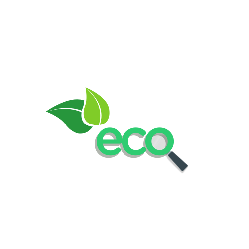

<!-- PROJECT LOGO -->
 

  

  <h3 align="center">🌳EcoLens🌳</h3>

  

    Join Ecolens to experience the new era of recycling
     
     
    <a href="https://github.com/zhanglollo/ecolens/issues/new?labels=bug&template=bug-report---.md">Report Bug</a>
    &middot;
    <a href="https://github.com/zhanglollo/ecolens/issues/new?labels=enhancement&template=feature-request---.md">Request Feature</a>
  

## About The Project

[![Product Name Screen Shot][product-screenshot]]

Eco Lens is an AI-powered app that helps users identify how to properly dispose of their waste by taking a photo. It’s designed to reduce contamination and promote eco-friendly habits.

Features:
* 📷 Image-based waste identification
* 🗑️ Disposal instructions (Recycle / Compost / Garbage)
* 📍 Localized waste sorting guidance

### Built With

We used the following tools when building the app:

* [![Swift][Swift.js]][Swift-url]
* [![OpenAI GPT][OpenAI]][OpenAI-url]

### Our Mission

At EcoLens, our mission is to empower individuals to make smarter, more sustainable waste disposal decisions. Through innovative AI technology, we provide real-time recommendations on how to properly dispose of or recycle everyday items. Whether it’s finding the right bin for an item or understanding the best way to reduce waste, we strive to make waste management simpler, more efficient, and environmentally friendly. We believe that small actions lead to big changes, and with EcoLens, everyone can contribute to a cleaner, more sustainable future.

[product-screenshot]: images/screenshot.png
[Swift.js]: https://img.shields.io/badge/Swift-F05138?logo=Swift&logoColor=white
[Swift-url]: https://swift.org/
[OpenAI]: https://img.shields.io/badge/OpenAI-%23412991?logo=openai&logoColor=white
[OpenAI-url]: https://openai.com/
